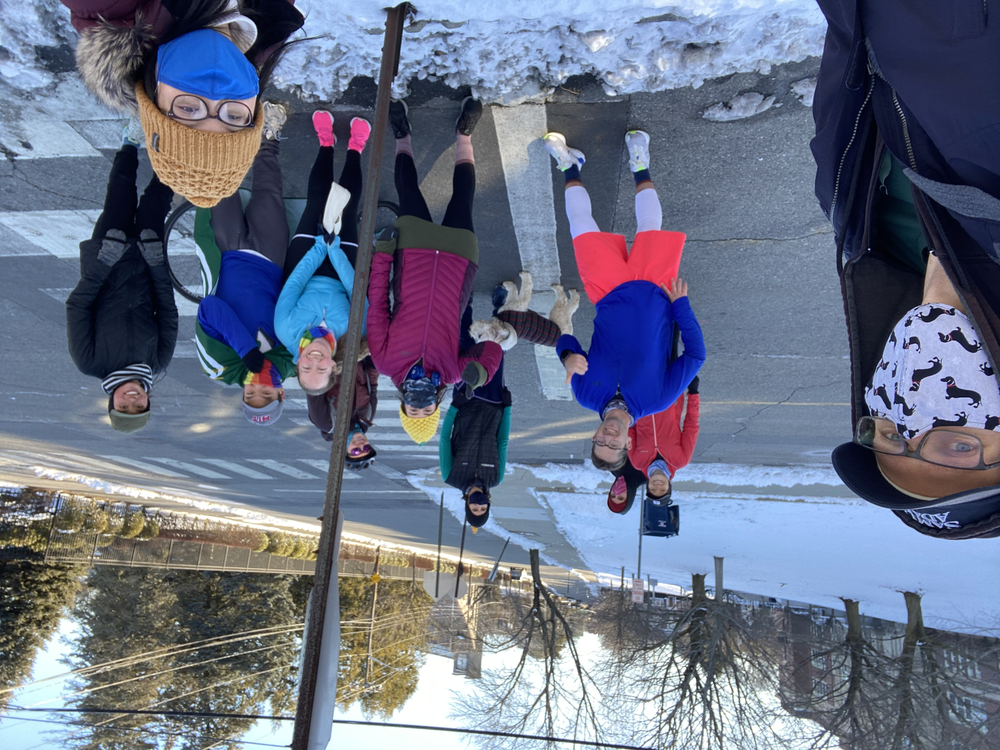

  
   

In October 2020 I decided to do a 10-week training plan for a half marathon. Of course, there are no half marathons right now, but on January 30th, 2021, I ran a half marathon, on a course I designed, with the help of several friends from the Providence Community Ultimate Team. Turns out January 30th was a terribly cold day, so that wasn't great, but everything else about the run was a blast. 

Fast forward a couple years and I would officially consider myself a runner. In 2022, I ran the Providence Marathon and several half marathons during training. I am currently training for the Ocean State Marathon, which takes place in Narragansett in October, 2022. On top of that, I have playing more frisbee. I decided to captain a team, along with a friend, for the 2022 season of RIPUL (summer league). Our team was orange in color, but we adopted the name Team Banana - since we are all big knock knock joke fans. Anyway, our team was awesome. We finished the regular season in first place and then we went undefeated at the tournament to win the league championship. As you can tell by the picture below, Team Banana was a wonderful bunch.

   

Since I am running more this year than I have ever run in my life, I thought it would be fun to track my mileage this year. You can clearly see the build up to the Providence Marathon in May, the summer lull when I played lots of frisbee (and as a result didn't do as many long runs), and now again as the running ramps up in preparation for the October race. 

<iframe width="600" height="371" seamless frameborder="0" scrolling="no" src="https://docs.google.com/spreadsheets/d/e/2PACX-1vR5pJ5K6dP_SXFUcCTiKw4wlRIaZwJjMfmOacz2Doq1Z6XF3Q4K68IHyAdING0wOGgZeG56Mb8Mzeq8/pubchart?oid=875357752&amp;format=interactive"></iframe>